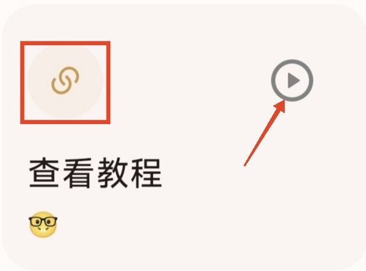
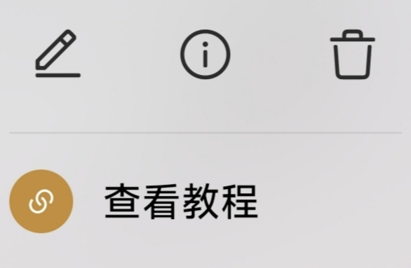
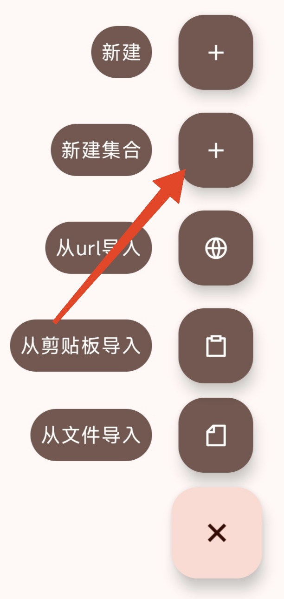
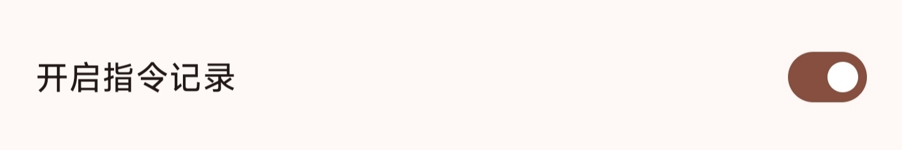

# 一键指令
本教程由@叶桐枫 贡献。

## 功能介绍

一键指令可以一键执行多个复杂动作，适用于实现某些一触即发的动作。

## **按键功能**

  右上角区域：执行一键指令
  左上角区域：打开一键指令的菜单界面 
  单击卡片：可进入编辑界面
  长按卡片：打开菜单界面

  

## 创建桌面快捷键

  在桌面创建一个图标，用于执行一键指令，图标取决于第一个动作的图标。
  注：需要授予Shortx “创建快捷方式” 权限。

 
## 创建/移除动态快捷键

  创建之后在桌面长按Shortx图标，即可看到一个所创建的动态快捷键，点击即可执行一键指令，除则消失。

  

## 副本

  复制一个相同的指令，用于备份。

## 编辑

  编辑动作，用于创建一键指令的[[动作]]。

## 分享

  将指令分享给别人，建议分享为文件。
  如何导入看这里[[导入指令]]。
## Deeplink

  生成一个链接，可以通过打开链接触发一键指令
  
  
## Shell cmd

  生成一个shell命令，可以在其他终端执行shell命令触发一键指令
  
 
## 移入/移出合集

  将指令移入/移出指定合集，合集需要自己创建。
 

## 指令记录

  只显示当前指令的记录，需要编辑指令打开 “开启指令记录” 开关。
  
## 删除
 删除指令。