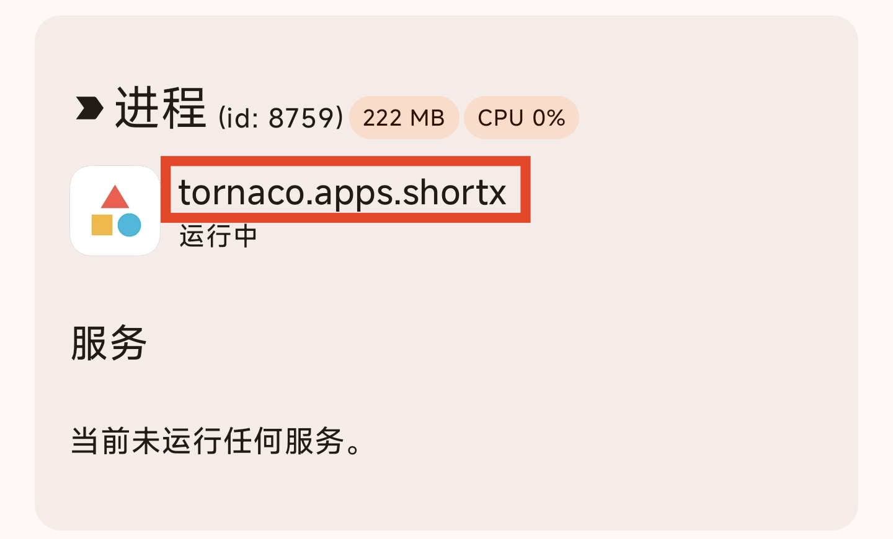
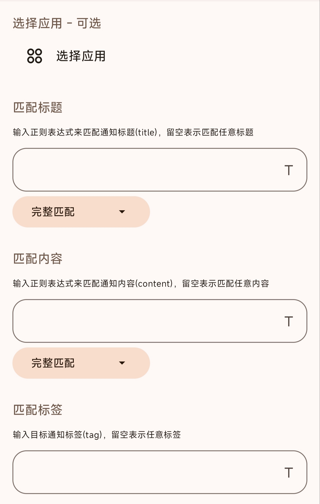
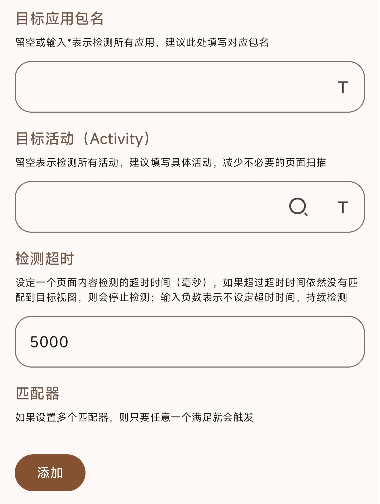
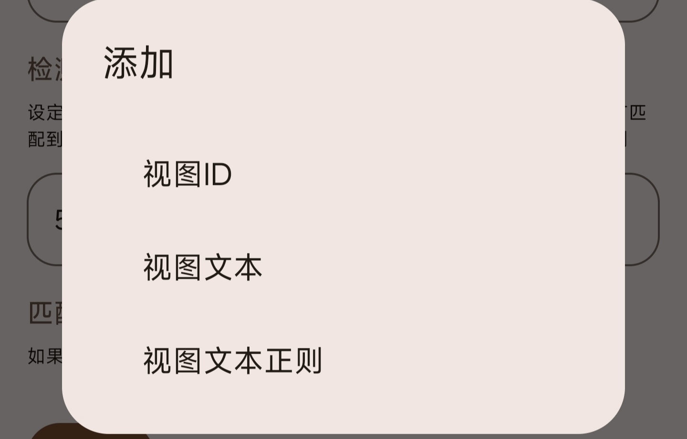

# 触发器
本教程由@叶桐枫 贡献。

## 应用
## Activity启动
### 任意活动

*触发条件*：任意界面启动。

### 指定的活动

*触发条件*：所选应用/应用集界面启动

### 上下文变量

| 变量名称              | 含义           |
| ----------------- | ------------ |
| pkgName           | 应用包名         |
| userId            | 当前所属用户       |
| appLabel          | 应用名称         |
| componentName     | 当前界面activity |
| activityIntentUri | 当前界面intent   |

## 前后台判断

### 应用回到前台 
*触发条件*：所选的应用/应用集回到前台。
### 应用回到后台
*触发条件*： 所选的应用/应用集回到后台。
### 上下文变量

| 变量名称              | 含义           |
| ----------------- | ------------ |
| pkgName           | 应用包名         |
| userId            | 当前所属用户       |
| appLabel          | 应用名称         |

## 进程启动
 此功能使用thanox的能力处理进程。
*触发条件*：当所填入的进程当中有一个启动。
### 上下文变量

| 变量名称        | 含义     |
| ----------- | ------ |
| processName | 进程名称   |
| pkgName     | 应用包名   |
| userId      | 当前所属用户 |
| appLabel    | 应用名称   |
### 获取进程名称
使用thanox，复制此处填入即可。

## 通知
### 有新通知
*触发条件*：符合条件且新发送的通知。

### 通知被移除
*触发条件*：符合条件的通知被移除。

### 通知更新
*触发条件*：符合条件且存在的通知被更新。

选择应用：不选则默认所有应用的通知都触发。
匹配标题/内容：留空表示匹配任意字符串。
* 完整匹配：完全符合所填的字符串。
* 包含匹配：包含所填的字符串。
* 可以通过[正则表达式](https://developer.mozilla.org/zh-CN/docs/Web/JavaScript/Guide/Regular_Expressions)来匹配。
匹配标签(tag)：留空表示匹配任意标签。
* 每个通知都存在一个标签(tag)，可以通过这个来识别标题和内容不固定的通知。
* 也可以用来匹配shortx所发送的通知
### 上下文变量

| 变量名称            | 含义      |
| --------------- | ------- |
| pkgName         | 通知的应用包名 |
| userId          | 当前所属用户  |
| title           | 通知的标题   |
| contentText     | 通知的内容   |
| notificationTag | 通知的标签   |

## 任务被移除
### 指定应用的任务
*触发条件*：所选应用/应用集的后台卡片被移除。

### 任意任务
*触发条件*：任意应用的后台卡片被移除。

### 上下文变量

| 变量名称     | 含义     |
| -------- | ------ |
| pkgName  | 应用包名   |
| userId   | 所属用户 |
| appLabel | 应用名称   |
| taskId   | 卡片ID   |

## 应用安装
### 应用安装 
*触发条件*：新的应用被安装。
#### 相关变量
| 变量名称    | 含义      |
| ------- | ------- |
| pkgName | 应用包名    |
| userId  | 所属用户    |
| label   | 安装的应用名称 |

### 应用更新
*触发条件*：所选已安装应用被更新。
#### 上下文变量
| 变量名称            | 含义     |
| --------------- | ------ |
| pkgName         | 应用包名   |
| userId          | 所属用户   |
| label           | 应用名称   |
| fromVersionCode | 更新前版本号 |
| toVersionCode   | 更新后版本号 |

### 应用卸载
*触发条件*：卸载已安装应用。
#### 相关变量
| 变量名称    | 含义   |
| ------- | ---- |
| pkgName | 应用包名 |
| userId  | 所属用户 |
| label   | 应用名称 |

## 应用停止运行
### 指定的应用
*触发条件*：所选应用/应用集应用停止运行。
### 任意应用
*触发条件*：任意应用停止运行。
### 相关变量
| 变量名称              | 含义           |
| ----------------- | ------------ |
| pkgName           | 应用包名         |
| userId            | 所属用户       |

## 音频
### 应用获得音频焦点
*触发条件*：所选应用开始播放声音。
### 应用失去音频焦点
*触发条件*：所选应用停止播放声音。
### 音频焦点发生变化
*触发条件*：声音播放发生变化
#### 上下文变量

| 变量名称    | 值          | 含义     |
| ------- | ---------- | ------ |
| pkgName |            | 应用包名   |
| userId  |            | 所属用户   |
| isGain  | true/false | 开始播放音频 |
| isLost  | true/false | 停止播放音频 |

## 窗口焦点
* 窗口焦点包括应用的前台，悬浮窗，小窗等所见窗口。
### 应用获得窗口焦点
*触发条件*：所选应用/应用集有可见窗口。
### 应用失去窗口焦点
*触发条件*：所选应用/应用集失去可见窗口。
## 发现页面视图
*触发条件*：发现符合条件的视图页面。

### 应用包名
* 填写检测的包名，为空则匹配任意应用。
* 支持变量。
### 目标活动(Activity)
* 填写检测的activity名称，建议填写具体活动。
* 可手动选取，支持变量。
### 检测超时
* 填写超时时间，单位毫秒。
* 如果超过所填时间仍然没有匹配到，则停止检测。
* 填写负数则不限制时间，直到找到
### 匹配器
  设置多个匹配器，任意一个符合则触发。
  
#### 视图ID
* 填写要匹配的视图ID。
* 获取视图ID请看[这里](https://b23.tv/BViwcW8)
#### 视图文本
* 填写要匹配的视图文本。
#### 视图文本正则
* 填写要匹配的视图文本，支持正则表达式。

